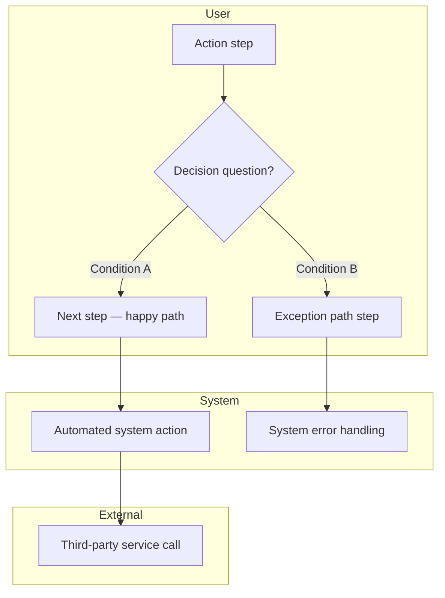

# Process Flows — Business Logic Layer

## Purpose

Map how processes actually work — the decision branches, business rules, system boundaries, and exception paths that sit underneath the user experience. This is the logic layer between user journeys (experiential) and information architecture (structural). It surfaces constraints in the Definition phase, before any screen structure is committed.

---

## Dependency check

Before running, check for:
- [ ] `design/03_JOURNEYS/` — journey outputs exist (provides the happy-path spine)
- [ ] `design/02_USER_MODELS/` — JTBD outputs exist (scopes each flow to a job)
- [ ] `design/01_DISCOVERY/domain-glossary.md` — glossary exists (canonical terms for entities and states)

If upstream dependencies are missing, warn the designer and ask whether to proceed or complete upstream first.

---

## Workflow

### Step 1 — Stale check

0. **Value alignment check:** If `design/01_DISCOVERY/value-framework.md` exists, verify that this mode's outputs can be traced to a vision element, driver, or lever defined there. If an output cannot be connected to a documented user need or a value lever, question whether it belongs. If no value framework exists yet, proceed — but flag any outputs whose purpose is unclear.

```
node design/scripts/sync-status.js
```

Report any stale upstream inputs before proceeding. If journeys or user models have changed since last run, ask the designer whether to re-process or continue.

### Step 2 — Identify flows

From user journeys, identify distinct end-to-end processes. Scope each flow to a single JTBD — one job, one flow. Name flows as `[Actor] [verb]` (e.g., "User submits request", "Admin reviews application").

Present the confirmed list to the designer before mapping.

### Step 3 — Map each flow

For each confirmed flow, produce one markdown file at `design/04_PROCESS_FLOWS/[flow-name].md` containing:

**3a — Happy path**
Trace the linear happy-path steps from the user journey. Keep steps UI and tech agnostic.

**3b — Actor lanes**
Assign each step to: User | System | External | Admin/Operator.

**3c — Decision nodes**
For every branching point: write the decision question, list all branches, name the condition for each.

**3d — Exception paths**
For every decision node, map what happens on every non-happy-path branch. Exception paths reveal missing screens, states, and scope decisions.

**3e — Business rules register**
For every decision node, document:

| Rule ID | Flow | Step | Condition | Outcome | Source |
|---------|------|------|-----------|---------|--------|
| BR-01 | | | | | |

Rules without a **Source** are flagged as assumptions and must be validated before IA begins.

### Step 4 — Write the summary index

Create `design/04_PROCESS_FLOWS/index.md` listing all flows with: brief description, primary actor, JTBD reference, and rule count.

### Step 5 — Validate upstream coverage

Cross-reference before completing:
- Every journey pain point addressable within the process logic?
- Every JTBD has a flow?
- Every entity and state name in the domain glossary?
- Exception paths that require user action flagged for IA?

Flag gaps — route back to upstream mode. Do not resolve them here.

### Step 6 — Version and manifest

```
node design/scripts/sync-version.js init design/04_PROCESS_FLOWS/index.md design-process-flows
node design/scripts/sync-manifest.js process-flows
```

---

## Diagram format



---

## Output checklist

- [ ] `design/04_PROCESS_FLOWS/index.md` — flow inventory with JTBD references
- [ ] One `design/04_PROCESS_FLOWS/[flow-name].md` per identified flow, each containing:
  - [ ] Mermaid flowchart with actor swimlanes
  - [ ] All decision nodes with explicit branch conditions
  - [ ] Exception paths documented at same fidelity as happy path
  - [ ] Business rules register (Rule ID, Flow, Step, Condition, Outcome, Source)
  - [ ] Assumptions flagged (rules without a source)
- [ ] Upstream validation complete, gaps flagged
- [ ] Version headers written, manifest updated

---

## Rules

- **UI and tech agnostic** — no button names, screen names, or implementation patterns. Describe what happens, not how the screen does it.
- **Every decision node is exhaustive** — all branches documented. An undocumented branch is a design gap, not a scope decision.
- **Business rules have sources** — every rule traces to a stakeholder input, document, or known constraint.
- **One flow per JTBD** — if a flow spans multiple jobs, split it.
- **Domain glossary terms only** — use canonical terms for all entities and states. No new terminology without a glossary update.
- **Exception paths are first-class** — diagram them and register their rules at the same fidelity as the happy path.
- **Business rule IDs are stable.** Once assigned, a BR-NN ID is permanent. If a rule is split, the original ID is retired with a note pointing to its successors. If merged, the surviving ID is kept and the retired one noted. Canvas briefs, interaction specs, and the traceability script depend on stable rule IDs.

---

### BRD enrichment

After completing the business rules register, enrich the BRD (`design/BRD.xlsx`) User Stories sheet:
- For each story affected by a business rule, append `[BR-NN] <condition> → <outcome>` to the acceptance criteria cell (col F)
- Update `design/BRD_manifest.md` with the business-rules-register version consumed

---

## Split-review note

> Per `design/process/README.md` (Skill architecture — P5: Artifact Coherence): process flows and business rules are tightly coupled artifacts consumed together by downstream modes. Keep as one skill unless the rules register grows large enough to warrant independent re-invocation (P2) — e.g., designers routinely update business rules without re-mapping flows.
