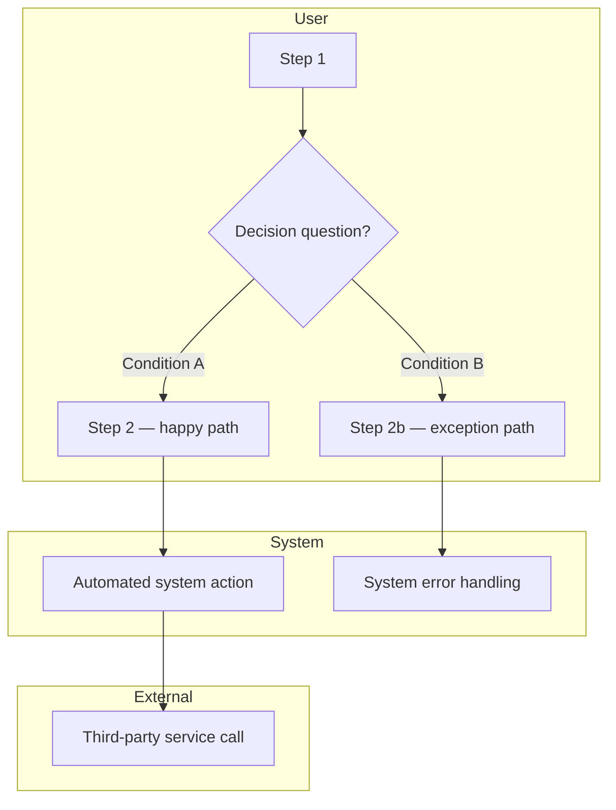

# Process Flows

> **Tier 2 — Definition** | Mode: `design-process-flows`

---

## Why this matters

Journey mapping captures what users experience. Process flows capture how the underlying process actually works — the decision branches, business rules, system boundaries, and exception paths that govern what happens at each step.

Without a logic layer, designers discover constraints late — during interaction design or development — when the cost of rework is highest. Process flows surface those constraints in the Definition phase, before any screen structure is committed.

---

## The mental model

A process flow sits between a user journey and an interaction model:

- **User journey** — what the user experiences (emotional arc, touchpoints, pain)
- **Process flow** — how the process works (decision logic, rules, actor responsibilities)
- **Interaction model** — how screens behave (states, transitions, error handling)

The user journey provides the happy-path spine. Process flows add the logic layer on top — parallel system actions, decision branches, business rule constraints, and the exception paths that are invisible in a journey map.

Each flow is composed of three layers:

1. **Actor lanes** — who or what performs each step (User, System, External Service, Admin/Operator)
2. **Decision nodes** — branching logic with explicit conditions for each branch
3. **Business rules register** — the rules that govern each decision, with source traceability

---

## Inputs

- User journeys (`design/03_JOURNEYS/`) — the happy path becomes the flow spine
- JTBD from user models (`design/02_USER_MODELS/`) — each job-to-be-done scopes one flow
- Domain glossary (`design/01_DISCOVERY/domain-glossary.md`) — canonical terms for entities, states, and rules
- Design brief (`design/01_DISCOVERY/design-brief.md`) — business constraints, regulatory requirements, scope boundaries

---

## Process

### Step 1 — Identify flows

From user journeys, identify distinct end-to-end processes. Scope each flow to a single JTBD — one job, one flow. Name flows as `[Actor] [verb]` (e.g., "User submits request", "Admin reviews application").

Present the flow list to the designer for confirmation before mapping.

### Step 2 — Map the happy path

For each confirmed flow, trace the linear happy-path steps from the user journey. Keep every step technology and UI agnostic — describe what happens, not how the screen implements it.

### Step 3 — Assign actor lanes

For each step, assign it to an actor lane:

| Lane | What it represents |
|------|--------------------|
| **User** | Steps the user initiates or performs |
| **System** | Automated system actions triggered by user or time |
| **External** | Third-party services, APIs, or integrations |
| **Admin / Operator** | Internal staff actions required to advance the process |

Steps in System, External, or Admin lanes are invisible to the user but must be designed for — they generate states, delays, and failure modes.

### Step 4 — Identify decision nodes

Walk the flow and mark every point where the process branches. For each decision node:
- Write the decision question as a yes/no or enumerated question
- List every possible branch
- Name the condition that triggers each branch

Do not collapse or simplify — every branch that exists in the real process must be mapped, including the ones no one wants to talk about.

### Step 5 — Map exception paths

For every decision node, map what happens when the non-happy-path branch is taken. Exception paths reveal:
- Missing screens or states in the IA
- Error messages and recovery flows needed in content
- States that interaction design must handle
- Edge cases that need release scope decisions in stories

### Step 6 — Write the business rules register

For every decision node, create a rule entry:

| Rule ID | Flow | Step | Condition | Outcome | Source |
|---------|------|------|-----------|---------|--------|
| BR-01 | | | | | |

- **Rule ID** — unique identifier (BR-01, BR-02…)
- **Flow** — which flow this applies to
- **Step** — which step in the flow
- **Condition** — the logic statement (use domain glossary terms)
- **Outcome** — what happens when the condition is met
- **Source** — stakeholder, document, regulatory requirement, or technical constraint

Rules without sources are flagged as assumptions and must be validated before IA begins.

### Step 7 — Validate upstream coverage

Before completing, cross-reference:
- Every journey pain point should be addressable within the process logic
- Every JTBD should have a flow
- Every entity and state name should appear in the domain glossary
- Flag gaps — do not resolve them here; route back to the upstream mode

---

## Outputs

**Per flow (one file each):** `design/04_PROCESS_FLOWS/[flow-name].md`

Each file contains:
- The Mermaid flowchart diagram with actor swimlanes, decision nodes, and exception paths
- The business rules register for that flow

**Summary index:** `design/04_PROCESS_FLOWS/index.md`

Lists all flows with: brief description, primary actor, JTBD reference, and count of business rules.

### Diagram template

---

## Downstream sync

| Mode | What process flows provides |
|------|-----------------------------|
| `design-stories` | Business rules and exception paths reveal hidden backbone activities, edge-case release constraints, and scope decisions |
| `design-ia` | Every exception path that requires user action needs a screen; business rule outcomes define content types |
| `design-interaction` | Decision nodes become state inventory items; each branch is a behavioral spec trigger |
| `design-content` | Business rule outcomes drive error messages, confirmation copy, and conditional label logic |
| `design-canvas` | Business rules register becomes a constraint table in each screen brief |

---

## Rules

- **UI and tech agnostic.** Flows describe what happens and why, not how the screen implements it. No button names, no screen names, no implementation patterns.

- **Every decision node is exhaustive.** All branches documented, including exception paths. An undocumented branch is a design gap — not a scope decision, a blind spot.

- **Business rules have sources.** Every rule must trace back to a stakeholder input, document, or known constraint. Rules without sources are flagged as assumptions.

- **One flow per JTBD.** If a flow spans multiple jobs, split it. A flow that cannot be named as `[Actor] [single action]` is probably two flows.

- **Domain glossary terms only.** All entity and state names in flows and rules use the glossary's canonical terms. Introduce no new terminology without updating the glossary first.

- **Exception paths are first-class.** Do not document exception paths as footnotes or afterthoughts. They belong in the main diagram and the rules register, with the same fidelity as the happy path.
